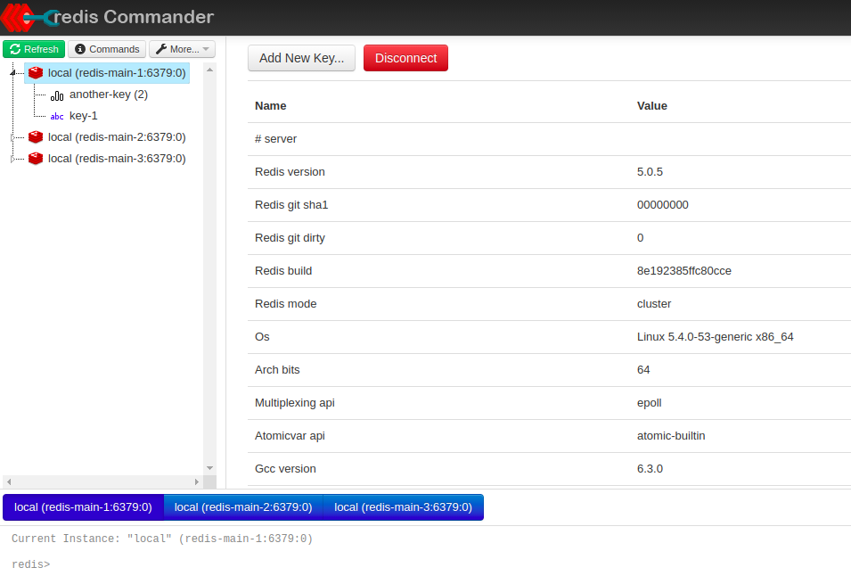

# Redis Commander

Redis web management tool written in node.js



# Install and Run

```bash
$ npm install -g redis-commander
$ redis-commander
```

Installation via `yarn` is currently not supported. Please use `npm` as package manager.

Or run Redis Commander as Docker image `ghcr.io/joeferner/redis-commander` ~~rediscommander/redis-commander~~ (instructions see below).

Multi-Arch images built are available at `ghcr.io/joeferner/redis-commander:latest`.
(https://github.com/joeferner/redis-commander/pkgs/container/redis-commander)

_Remark: new version are not published to Dockerhub right now._

# Features

Web-UI to display and edit data within multiple different Redis servers.
It can connect to Redis standalone server, Sentinel based setups and Redis Cluster.

It has support for the following data types to view, add, update and delete data:
* Strings
* Lists
* Sets
* Sorted Set
* Streams (Basic support based on HFXBus project from https://github.com/exocet-engineering/hfx-bus, only view/add/delete data)
* ReJSON documents (Basic support, only for viewing values of ReJSON type keys)

# Usage

```
$ redis-commander --help
Options:
  --version                            Show version number                                                                                      [boolean]
  --redis-port                         The port to find redis on.                                                                                [number]
  --redis-host                         The host to find redis on.                                                                                [string]
  --redis-socket                       The unix-socket to find redis on.                                                                         [string]
  --redis-username                     The redis username.                                                                                       [string]
  --redis-password                     The redis password.                                                                                       [string]
  --redis-db                           The redis database.                                                                                       [number]
  --redis-optional                     Set to true if no permanent auto-reconnect shall be done if server is down.             [boolean] [default: false]
  --redis-family                       Version of IP stack. 0, 4, or 6. Defaults to 0 to support both ipv4 and ipv6.                             [number]
  --sentinel-port                      The port to find sentinel on.                                                                             [number]
  --sentinel-host                      The host to find sentinel on.                                                                             [string]
  --sentinels                          Comma separated list of sentinels with host:port.                                                         [string]
  --sentinel-name                      The sentinel group name to use.                                                                           [string]
  --sentinel-username                  The sentinel username to use.                                                                             [string]
  --sentinel-password                  The sentinel password to use.                                                                             [string]
  --clusters                           Comma separated list of redis cluster server with host:port.                                              [string]
  --is-cluster                         Flag to use parameter from redis-host and redis-port as Redis cluster member            [boolean] [default: false]
  --cluster-no-tls-validation          Flag to disable tls host name validation within cluster setups (needed for AWS)         [boolean] [default: false]
  --redis-tls                          Use TLS for connection to redis server. Required for TLS connections.                   [boolean] [default: false]
  --redis-tls-ca-cert                  Use PEM-style CA certificate key for connection to redis server. Requires "redis-tls=true"                [string]
  --redis-tls-ca-cert-file             File path to PEM-style CA certificate key for connection to redis server. Requires "redis-tls=true", Overrides
                                       "redis-tls-ca-cert" if set too.                                                                           [string]
  --redis-tls-cert                     Use PEM-style public key for connection to redis server. Requires "redis-tls=true"                        [string]
  --redis-tls-cert-file                File path to PEM-style public key for connection to redis server. Requires "redis-tls=true", Overrides
                                       "redis-tls-cert" if set too.                                                                              [string]
  --redis-tls-key                      Use PEM-style private key for connection to redis server. Requires "redis-tls=true"                       [string]
  --redis-tls-key-file                 File path PEM-style private key for connection to redis server. Requires "redis-tls=true", Overrides
                                       "redis-tls-key" if set too.                                                                               [string]
  --redis-tls-server-name              Server name to confirm client connection. Server name for the SNI (Server Name Indication) TLS extension. Requires
                                       "redis-tls=true"                                                                                          [string]
  --sentinel-tls                       Enable TLS for sentinel mode. If no special "sentinel-tls-*" option is defined the redis TLS settings are
                                       reused ("redis-tls-*"). Required for TLS sentinel connections.                          [boolean] [default: false]
  --sentinel-tls-ca-cert               Use PEM-style CA certificate key for connection to sentinel. Requires "sentinel-tls=true"                 [string]
  --sentinel-tls-ca-cert-file          File path to PEM-style CA certificate key for connection to sentinel. Requires "sentinel-tls=true", Overrides
                                       "sentinel-tls-ca-cert" if set too.                                                                        [string]
  --sentinel-tls-cert                  Use PEM-style public key for connection to sentinel. Requires "sentinel-tls=true"                         [string]
  --sentinel-tls-cert-file             File path to PEM-style public key for connection to sentinel. Requires "sentinel-tls=true", Overrides
                                       "sentinel-tls-cert" if set too.                                                                           [string]
  --sentinel-tls-key                   Use PEM-style private key for connection to sentinel. Requires "sentinel-tls=true"                        [string]
  --sentinel-tls-key-file              File path to PEM-style private key for connection to sentinel. Requires "sentinel-tls=true", Overrides
                                       "sentinel-tls-key" if set too.                                                                            [string]
  --sentinel-tls-server-name           Server name to confirm client connection. Server name for the SNI (Server Name Indication) TLS extension. Requires
                                       "sentinel-tls=true"                                                                                       [string]
  --insecure-certificate               Disable certificate check for all certificates (Redis, Sentinel, Cluster). Should not be used in
                                       production!                                                                            [boolean] [Standard: false]
  --noload, --nl                       Do not load connections from config.                                                                     [boolean]
  --clear-config, --cc                 Clear configuration file.                                                                                [boolean]
  --migrate-config                     Migrate old configuration file in $HOME to new style.                                                    [boolean]
  --test                               Test final configuration (file, env-vars, command line).                                                 [boolean]
  --open                               Open web-browser with Redis-Commander.                                                  [boolean] [default: false]
  --redis-label                        The label to display for the connection.                                               [string] [default: "local"]
  --read-only                          Start app in read-only mode.                                                            [boolean] [default: false]
  --http-auth-username, --http-u       The http authorisation username.                                                        [string] [default: "test"]
  --http-auth-password, --http-p       The http authorisation password.                                                            [string] [default: ""]
  --http-auth-password-hash, --http-h  The http authorisation password hash.                                                       [string] [default: ""]
  --address                            The address to run the server on.                                                    [string] [default: "0.0.0.0"]
  --port                               The port to run the server on.                                                            [number] [default: 8081]
  --url-prefix                         The url prefix to respond on.                                                               [string] [default: ""]
  --trust-proxy                        App is run behind proxy (enable Express "trust proxy").                                 [boolean] [default: false]
  --max-hash-field-size                The max number of bytes for a hash field before you must click to view it.                   [number] [default: 0]
  --nosave, --ns                       Do not save new connections to config file.                                             [boolean] [default: false]
  --no-log-data                        Do not log data values from redis store.                                                [boolean] [default: false]
  --folding-char, --fc                 Character to fold keys at for tree view.                                                   [string] [default: ":"]
  --root-pattern, --rp                 Default root pattern for redis keys.                                                       [string] [default: "*"]
  --use-scan, --sc                     Use SCAN instead of KEYS.                                                                [boolean] [default: true]
  --scan-count                         The size of each separate scan.                                                            [number] [default: 200]
  -h, -?, --help                       Show help                                                                                                [boolean]
```

The connection can be established either via direct connection to redis server or indirect
via a sentinel instance. Most of this command line parameters map onto configuration params read from 
the config file - see [docs/configuration.md](docs/configuration.md) and [docs/connections.md](docs/connections.md).

## Configuration

Redis Commander can be configured by configuration files, environment variables or using command line
parameters. The different types of config values overwrite each other, only the last (most important)
value is used.

For configuration files the `node-config` module (https://github.com/lorenwest/node-config) is used, with default to json syntax.

The order of precedence for all configuration values (from least to most important) is:

- Configuration files

  `default.json` - this file contains all default values and SHOULD NOT be changed

  `local.json` - optional file, all local overwrites for values inside default.json should be placed here as well
  as a list of redis connections to use at startup

  `local-<NODE_ENV>.json` - Do not add anything else than connections to this file! Redis Commander will overwrite this whenever a
  connection is added or removed via user interface. Inside docker container this file is used to store
  all connections parsed from REDIS_HOSTS env var.
  This file overwrites all connections defined inside `local.json`

  There are some more possible files available to use - please check the node-config Wiki
  for a complete list of all possible file names (https://github.com/lorenwest/node-config/wiki/Configuration-Files)

- Environment variables - the full list of env vars possible (except the docker specific ones)
  can be got from the file `config/custom-environment-variables.json` together with their mapping
  to the respective configuration key.

- Command line parameters - Overwrites everything

To check the final configuration created from files, env-vars set and command line param overwrites
start redis commander with additional param "--test". All invalid configuration keys will be listed
in the output. The config test does not check if hostnames or ip addresses can be resolved.

More information can be found in the documentation at [docs/configuration.md](docs/configuration.md)
and [docs/connections.md](docs/connections.md).

*Remark: Errors on image startup with "permission denied" on config files might be caused due to
wrong runtime users running the image. "docker compose" in recent versions does not pick up the
user defined inside the Dockerfile and uses some other user, therefor it should be explicit set inside
the docker-compose.yml file as shown in the example file.*

## Environment Variables

These environment variables can be used starting Redis Commander as normal
application or inside docker container (defined inside file `config/custom-environment-variables.json`)
and at [docs/configuration.md](docs/configuration.md):

```
HTTP_USER
HTTP_PASSWORD
HTTP_PASSWORD_HASH
ADDRESS
PORT
READ_ONLY
URL_PREFIX
SIGNIN_PATH
ROOT_PATTERN
NOSAVE
NO_LOG_DATA
FOLDING_CHAR
VIEW_JSON_DEFAULT
USE_SCAN
SCAN_COUNT
FLUSH_ON_IMPORT
REDIS_CONNECTION_NAME
REDIS_LABEL
CLIENT_MAX_BODY_SIZE
BINARY_AS_HEX
```

## Additional Docker Environment Variables

All environment variables listed at "Environment Variables" can be used running image
with Docker. The following additional environment variables are available too (defined inside
docker startup script):

```
HTTP_PASSWORD_FILE
HTTP_PASSWORD_HASH_FILE
REDIS_PORT
REDIS_HOST
REDIS_SOCKET
REDIS_USERNAME
REDIS_PASSWORD
REDIS_PASSWORD_FILE
REDIS_TLS
REDIS_TLS_CA_CERT
REDIS_TLS_CA_CERT_FILE
REDIS_TLS_CERT
REDIS_TLS_CERT_FILE
REDIS_TLS_KEY
REDIS_TLS_KEY_FILE
REDIS_TLS_SERVER_NAME
REDIS_DB
REDIS_HOSTS
REDIS_OPTIONAL
REDIS_FAMILY
SENTINEL_PORT
SENTINEL_HOST
SENTINEL_NAME
SENTINEL_USERNAME
SENTINEL_PASSWORD
SENTINEL_PASSWORD_FILE
SENTINEL_TLS
SENTINEL_TLS_CA_CERT
SENTINEL_TLS_CA_CERT_FILE
SENTINEL_TLS_CERT
SENTINEL_TLS_CERT_FILE
SENTINEL_TLS_KEY
SENTINEL_TLS_KEY_FILE
SENTINEL_TLS_SERVER_NAME
SENTINELS
K8S_SIGTERM
CLUSTERS
IS_CLUSTER
CLUSTER_NO_TLS_VALIDATION
```
 A (partial) description for the mapping onto the cli params and into the config files can be found
at the [docs/connections.md](docs/connections.md) file.

The `K8S_SIGTERM` variable (default "0") can be set to "1" to work around kubernetes specifics
to allow pod replacement with zero downtime. More information on how kubernetes handles termination of old pods and the
setup of new ones can be found within the thread [https://github.com/kubernetes/contrib/issues/1140#issuecomment-290836405]

Hosts can be optionally specified with a comma separated string by setting the `REDIS_HOSTS` environment variable.

After running the container, `redis-commander` will be available at [localhost:8081](http://localhost:8081).

### Using TLS secured connections

Booth connections to the Redis server itself as well as to the Redis Sentinels (if used)
can be configured to require TLS encryption. With the simples use case just set 
the environment vars `REDIS_TLS=1` and (if sentinels are used) `SENTINEL_TLS=1`
to enable TLS without further checks and special configurations.

The corresponding command line parameters (starting Redis Commander locally without docker)
are

```--redis-tls --sentinel-tls```

More complex use cases are documented in the [docs/connections.md](docs/connections.md) file
at "Configure TLS Support".


### Valid host strings (used for REDIS_HOSTS)

the `REDIS_HOSTS` environment variable is a comma separated list of host definitions,
where each host should follow one of these templates:

`hostname`

`label:hostname`

`label:hostname:port`

`label:hostname:port:dbIndex`

`label:hostname:port:dbIndex:password`

Connection strings defined with `REDIS_HOSTS` variable do not support TLS connections.
If remote redis server needs TLS write all connections into a config file instead
of using `REDIS_HOSTS` (see [docs/connections.md](docs/connections.md) at the end 
within the more complex examples).

This environment variable `REDIS_HOSTS` does not support IPv6 addresses. It supports IPv4 or hostnames only due to ':' 
used as separator within IPv6 addresses and this fields here.

### With docker-compose

```yml
version: '3'
services:
  redis:
    container_name: redis
    hostname: redis
    image: redis

  redis-commander:
    container_name: redis-commander
    hostname: redis-commander
    image: ghcr.io/joeferner/redis-commander:latest
    restart: always
    environment:
    - REDIS_HOSTS=local:redis:6379
    ports:
    - "8081:8081"
    user: redis
```

Attention - later version of compose do not honor the "USER" directive from the Dockerfile anymore, 
user must be set explicit. Otherwise, "permission denied" errors are shown on startup.

### Without docker-compose

#### Simplest

If you're running redis on `localhost:6379`, this is all you need to get started.

```bash
docker run --rm --name redis-commander -d -p 8081:8081 \
  ghcr.io/joeferner/redis-commander:latest
```

#### Specify single host

```bash
docker run --rm --name redis-commander -d -p 8081:8081 \
  --env REDIS_HOSTS=10.10.20.30 \
  ghcr.io/joeferner/redis-commander:latest
```

#### Specify multiple hosts with labels

```bash
docker run --rm --name redis-commander -d -p 8081:8081 \
  --env REDIS_HOSTS=local:localhost:6379,myredis:10.10.20.30 \
  ghcr.io/joeferner/redis-commander:latest
```

## Kubernetes

An example deployment can be found at [k8s/redis-commander/deployment.yaml](k8s/redis-commander/deployment.yaml).

If you already have a cluster running with `redis` in the default namespace, deploy `redis-commander` with `kubectl apply -f k8s/redis-commander`. If you don't have `redis` running yet, you can deploy a simple pod with `kubectl apply -f k8s/redis`.

Alternatively, you can add a container to a deployment's spec like this:

```
containers:
- name: redis-commander
  image: ghcr.io/joeferner/redis-commander
  env:
  - name: REDIS_HOSTS
    value: instance1:redis:6379
  ports:
  - name: redis-commander
    containerPort: 8081
```

known issues with Kubernetes:

* using REDIS_HOSTS works only with a password-less redis db. You must specify REDIS_HOST on a password
  protected redis db
* using REDIS_HOSTS does not work with IPv6 addresses. For connections to IPv6 addresses either use `REDIS_HOST` and `REDIS_PORT`
  env var or a custom `config/local.json` configuration file mounted into the redis container.


## Helm chart

You can install the application on any Kubernetes cluster using Helm.
There is no helm repo available currently, therefore local checkout of helm sources inside 
this repo is needed:

```sh
helm -n myspace install redis-web-ui ./k8s/helm-chart/redis-commander
```

More [Documentation](k8s/helm-chart/README.md) about this Helm chart and its values.

## OpenShift V3

To use the stock Node.js image builder do the following.

1. Open Catalog and select the Node.js template
1. Specify the name of the application and the URL to the [redis-command github repository](https://github.com/joeferner/redis-commander.git)
1. Click the ```advanced options``` link
1. (optional) specify the hostname for the route - _if one is not specified it will be generated_
1. In the Deployment Configuration section
   * Add ```REDIS_HOST``` environment variable whose value is the name of the redis service - e.g., ```redis```
   * Add ```REDIS_PORT``` environment variable whose value is the port exposed of the redis service - e.g., ```6379```
   * Add value from secret generated by the [redis template](https://github.com/sclorg/redis-container/blob/master/examples/redis-persistent-template.json):
     * name: ```REDIS_PASSWORD```
     * resource: ```redis```
     * key: ```database-password```
1. (optional) specify a label such as ```appl=redis-commander-dev1```
   * _this label will be applied on all objects created allowing for easy deletion later via:_
   ```bash
   oc delete all --selector appl=redis-commander-dev1
   ```

## Dev Container

1. Open project in VSCode dev container
1. Run `redis-server` in one terminal
1. Run `npm ci` then `node bin/redis-commander.js` in another terminal
1. Clock on http://127.0.0.1:8081 in the terminal

## Helper Scripts
### Generate BCrypted password hash

Redis commander allows setting either a plain text password for http authentication or a "bcrypt" 
password hash.
To generate a hashed password the script `bin/bcrypt-password.js` can be used. The parameter "-p" to set password should be given. 

Usage example:
```shell script
$ git clone https://github.com/joeferner/redis-commander.git
$ cd redis-commander/bin
$ node bcrypt-password.js -p myplainpass
$2b$10BQPbC8dlxeEqB/nXOkyjr.tlafGZ28J3ug8sWIMRoeq5LSVOXpl3W
```

This generated hash can be set inside the config file as "server.httpAuth.passwordHash", as env var "HTTP_PASSWORD_HASH"
or on the command line as `--http-auth-password-hash`.
Running inside docker image a file containing this password hash can be set via env var 
`HTTP_PASSWORD_HASH_FILE`

## Build images based on this one

To use this images as a base image for other images you need to call "apk update" inside your Dockerfile
before adding other apk packages with "apk add foo". Afterwards, to reduce your image size, you may
remove all temporary apk configs too again as this Dockerfile does.
