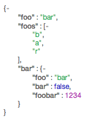
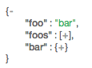

json-tree
=========

simple JS library that creates an html navigable tree from JSON object.

Example
------------


```html
<html lang="en">
	<head>
		<title>json tree example</title>
		<link href="css/jsontree.css" rel="stylesheet">
		<script src="jsontree.js"></script>
  	</head>
	<body>
		<div id="example"></div>
	</body>
	<script>
	var json = {"foo" : "bar", "foos" : ["b","a","r"], "bar" : {"foo":"bar", "bar":false,"foobar":1234}};
	document.getElementById("example").innerHTML = JSONTree.create(json);
	</script>
</html>
```
Full view

Collapsed view

